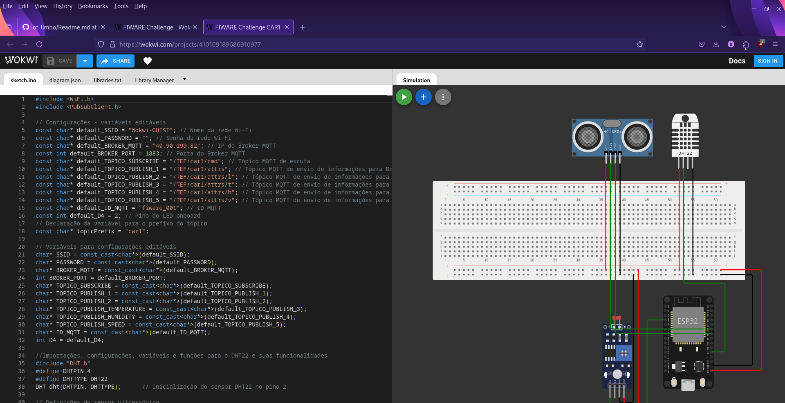

# ⚙️ Limbo Logic - Fórmula E Edge Computing 🚗⚡️

## 🌟 Sobre o Projeto

Este projeto, desenvolvido pela **Limbo Logic**, tem como objetivo promover a **Fórmula E** através de um **sistema interativo de monitoramento de condições ambientais**, utilizando **edge computing** com o auxílio do ESP32. O sistema monitora em tempo real os parâmetros de **luminosidade**, **temperatura** e **umidade** tanto nas pistas quanto nos carros de corrida, e exibe as informações em um site dedicado, proporcionando uma experiência imersiva para os usuários. 🌍💡

### 🖥️ Edge Computing na Fórmula E
Utilizando sensores espalhados tanto pelas **pistas** quanto nos **carros de corrida**, o projeto captura dados em tempo real e os envia para um **front-end dinâmico via protocolo MQTT**. Esses dados incluem informações sobre as condições ambientais da pista, assim como detalhes específicos de cada carro, como **velocidade**. O foco do projeto é entregar uma solução rápida e eficiente, processando os dados na borda da rede para garantir uma resposta quase imediata às mudanças no ambiente. ⚡📶

## 🔧 Funcionalidades

### 🏎️ Monitoramento de Pistas:
- **Luminosidade, temperatura e umidade** monitorados em pontos estratégicos da pista 📊
- Visualização dos dados ambientais do ponto no site com dashboard e indicadores em tempo real 📈

### 🚗 Simulação de Carros de Fórmula E:
- **Monitoramento de luminosidade, temperatura, umidade e velocidade** para cada carro 🏎️
- Três simulações independentes, uma para cada carro, permitindo o acompanhamento detalhado de cada um 🧑‍💻
- **Conexão com o front-end via MQTT**, possibilitando que o usuário acompanhe em tempo real no site da Fórmula E 🌐
- Visualização dos dados ambientais de cada carro no site com dashboard e indicadores em tempo real 📈

---

## 🛠️ Componentes Utilizados

- Placa de ensaio (Breadboard) 🛠️
- ESP32 🔌
- DHT22 (Sensor de Umidade e Temperatura) 🌡️
- Fotoresistor LDR (Sensor de Luz) 💡
- Sensores de Velocidade 🚗💨
- Protocolo MQTT para comunicação em tempo real 🌐📡

### 🔍 Descrição dos Principais Componentes

#### **💡 Fotoresistor LDR**
O LDR é um sensor que ajusta sua resistência conforme a intensidade da luz. Quando a luminosidade aumenta, a resistência diminui, e vice-versa. Este sensor é crucial para o monitoramento de luminosidade no ambiente das pistas e dos carros. 🌞🌒

#### **🌡️ DHT22 (Sensor de Umidade e Temperatura)**
Sensor multifuncional que mede a umidade e a temperatura com alta precisão. Suas leituras são fundamentais para ajustar as condições ideais de corrida, tanto nas pistas quanto no interior dos carros. 🌡️💧

#### **📡 Protocolo MQTT**
O protocolo MQTT permite que os dados capturados pelos sensores sejam enviados em tempo real para o front-end, proporcionando uma atualização contínua dos parâmetros ambientais e da performance dos carros no site. 🌐⚡

---

## 🏗️ Estrutura do Projeto

### 🏎️ Simulações no Wokwi
Este projeto conta com simulações tanto para os **pontos de monitoramento na pista** quanto para os **carros de corrida**. Cada carro possui uma simulação independente e sensores dedicados. 🎮

#### 🏎️ Simulações dos Carros:
- **Carro 1**: [Simulação Wokwi](https://wokwi.com/projects/410109189686910977)
- **Carro 2**: [Simulação Wokwi](https://wokwi.com/projects/410109226366111745)
- **Carro 3**: [Simulação Wokwi](https://wokwi.com/projects/410109243470486529)

#### 🏁 Simulações dos Pontos de Pista:
- **Ponto de Pista 1**: [Simulação Wokwi](https://wokwi.com/projects/409053935119694849)
- **Ponto de Pista 2**: [Simulação Wokwi](https://wokwi.com/projects/409053935119694849)

---

## 🚀 Como Funciona o Sistema

1. **Monitoramento em Tempo Real**: Os sensores de **luminosidade**, **temperatura**, **umidade** e **velocidade** coletam dados em tempo real, tanto dos carros quanto das pistas. 📡⚡
2. **Processamento via Edge Computing**: Os dados capturados são processados diretamente no local (no próprio ESP32), garantindo respostas imediatas, como a ativação das luzes e da buzina. 💻💡
3. **Transmissão via MQTT**: As informações são enviadas para o site através do protocolo MQTT, onde são exibidas de forma interativa e visualmente rica. 📊🌐
4. **Interface Interativa no Site**: No site, os usuários podem acompanhar o desempenho de cada carro, visualizar os dados ambientais e monitorar a segurança das pistas em tempo real. 🏎️📈

---

## 🎯 Conclusão

Este projeto da **Limbo Logic** é uma demonstração do potencial da **edge computing** aplicada ao esporte de alta performance como a **Fórmula E**. Ao conectar sensores diretamente aos carros e pistas, e exibir os dados em tempo real para os fãs através de um site interativo, entregamos uma experiência tecnológica única e imersiva. 🌟⚡🏁

---
## Simulações do Wokwi

### Simulação dos Carros

### Simulação dos Pontos de Pista

## Arquitetura do nosso sistema

## 💻 Desenvolvedores
| Desenvolvedor | Avatar | RM |
| ------------- | ------ | -- |
|  |  | RM555206 |
|  |  | RM554901 |
|  |  | RM558358 |
|  |  | RM555026 |
